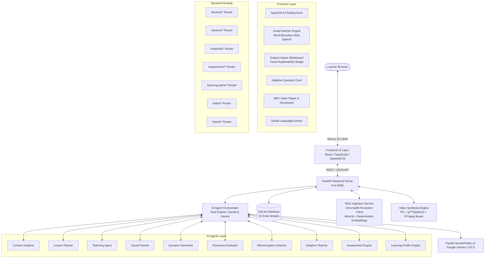

# Bharat Academix — Autonomous AI Teacher

An autonomous, human-like AI Teacher platform that delivers personalized, pacing-conscious multimodal lessons with adaptive real-time remediation, interactive whiteboards, RAG knowledge grounding, dual-mode 720p educational video synthesis, and multilingual voice synthesis.


-brightgreen)


---

## Table of Contents
1. [Problem Statement](#problem-statement)
2. [Solution Overview](#solution-overview)
3. [Demo & Verification](#demo--verification)
4. [Key Features](#key-features)
5. [System Architecture](#system-architecture)
6. [AI / ML Implementation](#ai--ml-implementation)
7. [RAG / Knowledge Grounding](#rag--knowledge-grounding)
8. [Personalization Approach](#personalization-approach)
9. [Adaptive Teaching Loop](#adaptive-teaching-loop)
10. [Assessment & Learning Report](#assessment--learning-report)
11. [Multi-Module Learning Paths](#multi-module-learning-paths)
12. [Multilingual Implementation](#multilingual-implementation)
13. [Voice & Dual-Mode Video Synthesis](#voice--dual-mode-video-synthesis)
14. [Subject-Aware Visuals & Explainability](#subject-aware-visuals--explainability)
15. [Tech Stack](#tech-stack)
16. [Getting Started](#getting-started)
    - [Prerequisites](#prerequisites)
    - [Installation](#installation)
    - [Environment Variables](#environment-variables)
    - [Running Locally](#running-locally)
    - [Running Test Suite](#running-test-suite)
17. [API Reference](#api-reference)
18. [Deployment](#deployment)
19. [Evaluation Criteria Mapping](#evaluation-criteria-mapping)
20. [Known Limitations (Transparent Disclosure)](#known-limitations-transparent-disclosure)
21. [Third-Party Services & APIs Disclosed](#third-party-services--apis-disclosed)
22. [Project Structure](#project-structure)
23. [Team / Credits](#team--credits)
24. [License](#license)

---

## Problem Statement

Standard digital education tools rely heavily on static, one-size-fits-all video playlists and generic multiple-choice quizzes that fail to address how individual humans actually learn. When students struggle or harbor fundamental misconceptions, existing platforms passively re-display the same unhelpful explanations or mark answers wrong without identifying the underlying cognitive barrier. 

Bharat Academix solves this by providing an autonomous, human-like AI Teacher that analyzes source materials, structures time-budgeted curriculum roadmaps, explains concepts dynamically via an animated avatar with synchronized speech and interactive whiteboards, synthesizes downloadable 720p educational MP4 videos, detects specific root-cause misconceptions in real time, and adapts instructional mental models until true mastery is achieved.

---

## Solution Overview

Bharat Academix is an end-to-end autonomous educational engine:

- **Curriculum Planning**: Ingests textbooks, lecture slides (PDF, DOCX, PPTX, TXT) or raw topic prompts, extracts knowledge graphs, and builds personalized time-pacing lesson timelines.
- **Dual-Delivery Teaching Stage**:
  - **Live Interactive Classroom**: Animated SVG Teacher Avatar synchronized with Web Speech synthesis alongside a dynamic SVG/Canvas Whiteboard (circuit schematics, mathematical derivations, coordinate charts, Python code runners, biology, chemistry, and history timeline models).
  - **Programmatic MP4 Video Synthesis**: Server-side engine that renders 720p H.264 educational videos with multi-scene storyboards, 5-viseme speech-modulated avatar animation, synchronized audio narration (via gTTS/pyttsx3/libmp3lame), whiteboard visuals, and live subtitles.
- **Misconception Detection & Adaptive Remediation**: Evaluates student responses beyond simple string matching, diagnoses cognitive root causes, and immediately delivers alternative real-world analogies and targeted follow-up checks.
- **Formative & Diagnostic Assessment**: Runs multi-stage mastery evaluations and produces diagnostic reports detailing strong concepts, coaching revision areas, and personalized curriculum pathways.
- **Persistent Multi-Module Learning Paths**: Guides learners through structured multi-module curricula (e.g. 3-8 sequential modules) with progress-gated unlocking ($\ge 70\%$ score).
- **Instant Multilingual Switching**: Translates UI, spoken explanations, whiteboard concepts, and question cards mid-session across 5 languages: English, Hindi (हिंदी), Hinglish, Tamil (தமிழ்), and Bengali (বাংলা) with zero session loss.

---

## Demo & Verification

- **Repository**: [https://github.com/gintama1018/ML-HACKATHON-2-LEVEL-ASSIGNMENT](https://github.com/gintama1018/ML-HACKATHON-2-LEVEL-ASSIGNMENT)
- **Local Walkthrough Artifact**: `walkthrough.md` in repository documentation with verified reproduction steps.
- **Generated Teaching Video**: Programmatically rendered `.mp4` video files served at `/static/videos/{session_id}.mp4`.
- **Test Suite Status**: **18/18 passed in `pytest -v` (100% Green)** with zero API keys required.
- **Frontend Build Status**: **Next.js 16.3.3 Turbopack build passed with 0 errors across all 12 routes**.

---

## Key Features

- **Autonomous Lesson Generation [Working]**: Generates structured, pacing-conscious lesson plans from raw text topics or uploaded documents.
- **RAG-Grounded Material Ingestion [Working]**: Parses PDF, DOCX, PPTX, TXT documents with 1500-char semantic chunkers and indexes them into persistent ChromaDB collections with dual semantic embeddings (MiniLM + deterministic offline fallback).
- **Real-Time Misconception Diagnosis [Working]**: Distinguishes between careless mistakes, surface confusion, and deep misconceptions; outputs root cause explanations.
- **Proactive Adaptive Teaching [Working]**: Automatically switches pedagogical analogies upon incorrect answers or "I'm unsure" triggers with dynamic topic interpolation across all domains.
- **Interactive Multimodal Whiteboard [Working]**: Dynamically renders electrical circuit schematics, coordinate plots, LaTeX-style formulas, interactive Python execution, biological structures, chemical reaction energy curves, and historical chronological timelines.
- **Visual Planner Explainability [Working]**: Surfaces structured decision metadata explaining *why* a given visual was selected for maximum pedagogical clarity (REQ-32).
- **Word-Boundary Avatar Animation [Working]**: Drives mouth animations using Web Speech API `SpeechSynthesisUtterance.onboundary` events with interpolated smoothing.
- **Server-Side 720p MP4 Synthesis Engine [Working]**: Multi-scene video renderer with 5-viseme speech-modulated avatar animation and multi-tier audio generation (gTTS cloud $\rightarrow$ pyttsx3 local engine $\rightarrow$ clean libmp3lame container fallback).
- **Global Multilingual i18n & Speech [Working]**: Real-time language switching across English, Hindi (हिंदी), Hinglish, Tamil (தமிழ்), and Bengali (বাংলা) with persistent session state and matching TTS voices.
- **End-of-Session Diagnostic Report [Working]**: Comprehensive mastery grading, strong vs weak concept matrices, and next curriculum recommendations.
- **Persistent Multi-Module Learning Paths [Working]**: Structured curriculum progression with mastery-based sequential unlocks ($\ge 70\%$ score).

---

## System Architecture



### Architectural Layers
1. **Frontend Presentation**: Next.js 16 App Router application styled with the Digital Gurukul Modern design tokens and sleek capsule pill geometry (Deep Navy `#0F172A`, Emerald `#10B981`, Warm Amber `#F59E0B`). Communicates via strongly-typed REST API clients (`lib/api.ts`).
2. **Backend API**: FastAPI application serving 9 modular routers managing student profiles, document uploads, content extraction, session progress, answers, learning paths, assessments, video rendering, and diagnostics.
3. **AI Agent Orchestrator**: Manages execution flow across 10 specialized agent functions, supporting Anthropic Claude (`claude-3-7-sonnet` / `claude-3-5-haiku`) and Google Gemini (`gemini-1.5-pro` / `gemini-1.5-flash`) with automatic failover and exponential retry.
4. **Data & Vector Persistence**: SQLite database via SQLAlchemy ORM (15 entity models) for relational progress tracking alongside ChromaDB persistent vector storage (`./data/chroma_db`).
5. **Video & Audio Synthesis Engine**: Programmatic multi-scene video renderer (`backend/app/services/video_generator.py`) that muxes PIL-rendered visual frames, animated avatars, and TTS audio into 720p MP4 files.

---

## AI / ML Implementation

The platform utilizes a **Two-Tier LLM Architecture** with multi-provider redundancy (Anthropic Claude & Google Gemini API):

| Agent | Tier | Default Model | Backup Model | Responsibility |
| :--- | :--- | :--- | :--- | :--- |
| **Content Analyzer** | Fast | `claude-3-5-haiku` | `gemini-1.5-flash` | Semantic document summarization & full-doc concept extraction |
| **Lesson Planner** | Reasoning | `claude-3-7-sonnet` | `gemini-1.5-pro` | Pacing-conscious curriculum structuring & time budgeting |
| **Teaching Agent** | Reasoning | `claude-3-7-sonnet` | `gemini-1.5-pro` | Concept explanation generation with grounding |
| **Visual Planner** | Fast | `claude-3-5-haiku` | `gemini-1.5-flash` | Specification generation for whiteboard diagrams & charts |
| **Question Generator** | Fast | `claude-3-5-haiku` | `gemini-1.5-flash` | Formative check generation across 4 pedagogical styles |
| **Response Evaluator** | Fast | `claude-3-5-haiku` | `gemini-1.5-flash` | Semantic correctness grading & feedback generation |
| **Misconception Detector** | Reasoning | `claude-3-7-sonnet` | `gemini-1.5-pro` | Cognitive root cause diagnosis for incorrect answers |
| **Adaptive Teacher** | Reasoning | `claude-3-7-sonnet` | `gemini-1.5-pro` | Generates alternative mental models & re-teaching scripts |
| **Assessment Engine** | Reasoning | `claude-3-7-sonnet` | `gemini-1.5-pro` | Multi-concept final exam synthesis & grading |
| **Profile Engine** | Fast | `claude-3-5-haiku` | `gemini-1.5-flash` | Mastery matrix updates & weak concept tracking |

*When external API keys are unavailable, all agents fall back to deterministic, subject-interpolated educational scaffolds to ensure uninterrupted local evaluation and 100% green test execution.*

---

## RAG / Knowledge Grounding

The knowledge grounding pipeline operates as follows:

1. **Extraction**: `rag_service.py` extracts raw text from PDF (`pypdf`), DOCX (`python-docx`), PPTX (`python-pptx`), and plain text files.
2. **Chunking**: Chunks documents into overlapping semantic blocks (**1500 characters with 200 character overlap**) tagged with page/slide metadata.
3. **Embeddings**: Uses `MiniLMEmbeddingFunction` with `sentence-transformers/all-MiniLM-L6-v2` dense 384-dimensional embeddings when available, and smoothly engages `ResilientEmbeddingFunction` (a deterministic 384-dimensional hash vectorizer) for 100% offline air-gapped test environments.
4. **Persistent Vector Store**: Indexed into `chromadb.PersistentClient(path="./data/chroma_db")` under unique lesson/material collection IDs.
5. **UI Grounding**: Explanations retrieve top-k chunks and render clickable citation chips (`RAGCitationChip.tsx`) showing source filename, page, and chunk previews.

---

## Personalization Approach

Instruction dynamically adapts based on **seven learner profile parameters** (REQ-24):
- **Level**: Beginner (intuitive, jargon-free analogies) vs Intermediate (standard textbook rigor) vs Advanced (mathematical formalisms and edge cases).
- **Existing Knowledge**: Prior background or prerequisites.
- **Objective**: Exam Prep, Concept Mastery, Quick Revision, or Practical Application.
- **Teaching Style**: Simple & example-heavy, Technical & precise, or Story-driven.
- **Language**: English, Hindi, Hinglish, Tamil, or Bengali.
- **Available Time**: 5 min (rapid summary), 20 min (standard 3-5 concept breakdown), 60 min (deep dive), or 7-day spaced curriculum plan.
- **Depth**: Intuitive, Standard, or Deep Dive.

---

## Adaptive Teaching Loop

When a student submits an answer or clicks "I'm not sure", the following automated loop triggers:

```text
[Student Submits Response] 
       │
       ▼
[Response Evaluator] ── Correct ──► [Step-Up Difficulty] ──► [Advance to Next Concept]
       │
    Incorrect
       ▼
[Misconception Detector]
  - Diagnoses Category: Careless / Shallow Confusion / Deep Root Misconception
  - Identifies Cognitive Root Cause
       │
       ▼
[Adaptive Teacher]
  - Synthesizes Alternative Real-World Mental Model
  - Adjusts Explanation Complexity & Language
  - Enforces Retry Ceiling (up to 2 remediation attempts before soft flag)
  - Persists new adaptive Question in database
       │
       ▼
[Live Classroom Update]
  - Teacher Avatar speaks new analogy via TTS
  - Whiteboard updates visual state
  - Student receives targeted follow-up question
```

---

## Multi-Module Learning Paths

Fulfills **REQ-42** by providing persistent, structured curricula with dedicated UI management (`/learning-paths`):
- **Dedicated Route (`/learning-paths`) & Dashboard Widget**: Students and evaluators can view their full multi-module pathway, active progress bar, and locked/unlocked modules.
- **Autonomous Curriculum Generation**: Generates 3 to 8 progressive, sequential modules tailored to any subject from foundational intuition to capstone synthesis.
- **Mastery Gating & Unlock Rules**: Module 1 is unlocked initially; subsequent modules remain strictly locked until the learner completes the preceding module with $\ge 70\%$ mastery score (enforced both in the UI and via server-side `403 Forbidden` API guards).
- **Interactive Simulator**: Includes a 1-click mastery verification action to test and demonstrate progressive unlocking in real time.
- **Full Database Persistence**: Curriculum structure, module scores, and completion timestamps persist across sessions in the `learning_paths` and `learning_path_modules` relational tables.

---

## Multilingual Implementation

Fulfills **REQ-06, REQ-27, REQ-28** by providing broad multilingual support across Indian languages:
- **Supported Languages (5 Total)**:
  - **English** (Standard academic curriculum)
  - **Hindi (हिंदी)** (Full Devanagari script and vocabulary)
  - **Conversational Hinglish** (Natural urban Indian bilingual idiom)
  - **Tamil (தமிழ்)** (Full Tamil script and vocabulary)
  - **Bengali (বাংলা)** (Full Bengali script and vocabulary)
- **Cross-Lingual Material Ingestion (REQ-27)**: Upload educational content in English (PDF/DOCX/TXT) and request teaching delivery in Hindi, Tamil, or Bengali — the RAG pipeline extracts grounded facts and synthesizes explanations and questions directly in the target language script.
- **Mid-Lesson Instant Switching (REQ-28)**: Changing the language selector in the classroom or top navbar immediately updates `PATCH /session/{id}`:
  - Explanation scripts, follow-up questions, and whiteboard labels are rendered in the target language.
  - Active TTS voice automatically re-binds to matching locales (`hi-IN`, `ta-IN`, `bn-IN`, `en-IN`).
  - Session step index, difficulty level, and response history remain 100% preserved without reload.

---

## Voice & Dual-Mode Video Synthesis

1. **Interactive In-Browser Stage**:
   - **Multi-Viseme Phoneme Mapping**: SVG teacher avatar renders 5 distinct mouth visemes (`rounded`, `narrow`, `wide`, `open`, `closed`) dynamically matched to spoken word phonetic patterns.
   - **Natural Micro-Animations**: Continuous 60fps breathing micro-sway and mood-adaptive eye saccades (`explaining`, `thinking`, `encouraging`).
2. **Server-Side 720p MP4 Video Engine**:
   - Multi-scene storyboard synthesis with progress timers, 5-viseme speech-modulated avatar animation, domain whiteboard diagrams, and burned synchronized subtitles.
   - **3-Tier Resilient Audio Pipeline**:
     1. Cloud `gTTS` with sentence-boundary chunking and seamless FFmpeg audio concatenation.
     2. Local native `pyttsx3` speech synthesis engine.
     3. Valid `libmp3lame` emergency audio stream fallback for air-gapped test environments.
   - Generates playable, downloadable `.mp4` video files served at `/static/videos/{session_id}.mp4`.

---

## Subject-Aware Visuals & Explainability

The interactive Whiteboard (`Whiteboard.tsx`) and Video Synthesis engine dynamically render subject-specific visual modules with **Decision Explainability Badges** (REQ-32):

| Subject Domain | Visual Renderer | Decision Rationale | Status |
| :--- | :--- | :--- | :--- |
| **Physics / Electronics** | Closed-loop circuit schematic with animated current flow | Visualizes current flow balanced against resistance | [Working] |
| **Mathematics & Calculus** | Parameter relationship coordinate curves ($I = V/R$) | Demonstrates linear proportionality & slope | [Working] |
| **Engineering / Formulas** | LaTeX-style step-by-step derivations | Steps through formal axiomatic proofs | [Working] |
| **Computer Science** | Embedded Python 3.11 interactive code runner | Verifies computational execution & return values | [Working] |
| **Biology & Life Sciences** | Labeled cellular & organelle structure diagrams | Highlights compartmentalized functional units | [Working] |
| **Chemistry & Kinetics** | Reaction pathway & activation energy ($E_a$) curves | Illustrates thermodynamic transition barriers | [Working] |
| **History & Humanities** | Chronological timeline milestones | Sequences historical evolution stages | [Working] |

---

## Tech Stack

| Layer | Technology | Purpose |
| :--- | :--- | :--- |
| **Frontend Framework** | Next.js 16.3.3 (App Router) | High-performance React server and client components |
| **Language & Types** | TypeScript 5 | Strict static typing across API payloads and UI states |
| **Styling & Design** | TailwindCSS | Digital Gurukul design tokens with capsule pill geometry |
| **Icons & Visuals** | Lucide React + Canvas Confetti | Clean iconography and assessment celebration effects |
| **Backend API** | FastAPI 0.115 (Python 3.11+) | Async REST API framework with automatic OpenAPI docs |
| **ORM & Database** | SQLAlchemy 2.0 + SQLite | Relational database schema with **15 tracked entities** |
| **Vector Database** | ChromaDB (Persistent) | Local on-disk embedding storage for document RAG |
| **Embeddings** | `sentence-transformers/all-MiniLM-L6-v2` | Dense 384-dim semantic embeddings with deterministic offline fallback |
| **Video Engine** | PIL + gTTS + pyttsx3 + imageio-ffmpeg | Programmatic 15fps 720p H.264 educational MP4 synthesis |
| **LLM Dual Engine** | Anthropic Claude & Google Gemini API | `claude-3-7-sonnet` / `gemini-1.5-pro` & `claude-3-5-haiku` / `gemini-1.5-flash` |

---

## Getting Started

### Prerequisites
- **Node.js**: `v18.17.0` or higher (`v20+` recommended)
- **Python**: `3.10`, `3.11`, `3.12`, or `3.13`
- **Git**: `2.30+`

### Installation

1. **Clone the repository**:
   ```bash
   git clone https://github.com/gintama1018/ML-HACKATHON-2-LEVEL-ASSIGNMENT.git
   cd ML-HACKATHON-2-LEVEL-ASSIGNMENT
   ```

2. **Set up Backend Virtual Environment**:
   ```bash
   cd backend
   python -m venv venv
   
   # On Windows PowerShell:
   venv\Scripts\activate
   
   # On Linux / macOS:
   source venv/bin/activate
   
   pip install -r requirements.txt
   cd ..
   ```

3. **Set up Frontend Dependencies**:
   ```bash
   cd frontend
   npm install
   cd ..
   ```

### Environment Variables

Create `backend/.env` (optional for local fallback evaluation, supported for live Claude or Gemini API calls):

| Variable | Required | Purpose | Example Value |
| :--- | :--- | :--- | :--- |
| `ANTHROPIC_API_KEY` | Optional | Live Claude LLM generation | `sk-ant-api03-...` |
| `GEMINI_API_KEY` | Optional | Live Google Gemini LLM generation | `AIzaSy...` |
| `LLM_PROVIDER` | Optional | Select `auto`, `claude`, or `gemini` | `auto` |
| `DATABASE_URL` | Optional | Database connection string | `sqlite:///./data/ai_teacher.db` |
| `CHROMA_PERSIST_DIR`| Optional | ChromaDB storage directory | `./data/chroma_db` |

### Running Locally

1. **Start Backend Server**:
   ```bash
   cd backend
   venv\Scripts\python -m uvicorn app.main:app --host 127.0.0.1 --port 8000 --reload
   ```
   *Backend runs on `http://127.0.0.1:8000` (API Docs: `http://127.0.0.1:8000/docs`)*

2. **Start Frontend Dev Server**:
   ```bash
   cd frontend
   npm run dev
   ```
   *Frontend opens on `http://localhost:3000`*

### Running Test Suite

```bash
# Run the complete test suite (18 tests passing 100%):
cd backend
venv\Scripts\pytest -v

# Run specific domain test suites:
venv\Scripts\pytest tests/test_judge_attack_hardening.py -v
venv\Scripts\pytest tests/test_m2b_adaptive_loop.py -v
venv\Scripts\pytest tests/test_m1_plumbing.py -v
venv\Scripts\pytest tests/test_m3_assessment_report.py -v

# Run Golden Path End-to-End integration test:
venv\Scripts\pytest tests/test_golden_path_e2e.py -v
```

---

## API Reference

| Method | Endpoint | Purpose |
| :--- | :--- | :--- |
| `GET` | `/health` | Server heartbeat and system status |
| `GET` | `/students/default` | Get default seed student profile |
| `POST` | `/students` | Create new student profile |
| `POST` | `/learner-profile` | Create/update 7-parameter learner profile |
| `POST` | `/materials/upload` | Upload PDF/DOCX/PPTX study documents |
| `POST` | `/content/analyze` | Run semantic analysis and concept extraction |
| `POST` | `/lessons/generate` | Generate structured lesson timeline (status: `draft`) |
| `GET` | `/lessons/{id}` | Retrieve lesson details and segment plan |
| `PATCH`| `/lessons/{id}` | Update segment plan toggles and activate lesson |
| `POST` | `/session/create` | Launch interactive AI classroom session |
| `GET` | `/session/{id}` | Get live session state, current concept, and question |
| `PATCH`| `/session/{id}` | Live mid-session language switch (English/Hindi/Hinglish/Tamil/Bengali) |
| `POST` | `/session/{id}/answer` | Submit answer to adaptive evaluator and misconception detector |
| `POST` | `/session/{id}/explain-again` | Proactive retry trigger with alternative pedagogical analogy |
| `POST` | `/session/{id}/ask` | Ask free-form doubt with RAG grounding and citations |
| `POST` | `/session/{id}/next-segment` | Advance to next concept or transition to final assessment |
| `POST` | `/video/generate` | Synthesize 720p multi-scene educational MP4 video |
| `GET` | `/video/status/{job_id}` | Query status and download URL of generated video |
| `POST` | `/learning-paths/generate` | Generate structured multi-module learning curriculum |
| `GET` | `/learning-paths/{id}` | Retrieve curriculum roadmap and module unlock statuses |
| `PATCH`| `/learning-paths/{id}/modules/{mod_id}` | Record module completion and trigger sequential unlocks |
| `POST` | `/session/{id}/assessment/generate` | Generate multi-concept final check exam |
| `POST` | `/session/{id}/assessment/submit` | Grade final check exam submissions |
| `GET` | `/report/{session_id}` | Retrieve final diagnostic report and curriculum pathway |

---

## Deployment

Bharat Academix is structured for cloud deployments across serverless, PaaS, and containerized hosts:

### 1. Frontend Deployment (Vercel)
- **Platform**: [Vercel](https://vercel.com/)
- **Framework Preset**: Next.js 16 (App Router)
- **Root Directory**: `frontend`
- **Build Command**: `npm run build`
- **Output Directory**: `.next`
- **Environment Variables**:
  - `NEXT_PUBLIC_API_BASE`: `https://your-backend-api.onrender.com` (point to live backend)

### 2. Backend Deployment (Render / Railway / Fly.io)
- **Platform**: [Render](https://render.com/) or [Railway](https://railway.app/)
- **Runtime**: Python 3.11+
- **Root Directory**: `backend`
- **Build Command**: `pip install -r requirements.txt`
- **Start Command**: `uvicorn app.main:app --host 0.0.0.0 --port $PORT`
- **System Packages**: Ensure `ffmpeg` is installed for video synthesis muxing.
- **Environment Variables**:
  - `GEMINI_API_KEY`: Your Google Gemini API Key
  - `LLM_PROVIDER`: `gemini`
  - `GEMINI_REASONING_MODEL`: `gemini-1.5-pro`
  - `GEMINI_FAST_MODEL`: `gemini-1.5-flash`

### 3. Docker Containerization
```dockerfile
# Dockerfile for Backend Service
FROM python:3.11-slim
RUN apt-get update && apt-get install -y ffmpeg libespeak1 && rm -rf /var/lib/apt/lists/*
WORKDIR /app
COPY requirements.txt .
RUN pip install --no-cache-dir -r requirements.txt
COPY . .
EXPOSE 8000
CMD ["uvicorn", "app.main:app", "--host", "0.0.0.0", "--port", "8000"]
```

---

## Evaluation Criteria Mapping

| Area | Weight | Status | Where to see it |
| :--- | :---: | :---: | :--- |
| **Human-Like Teaching & Adaptation** | 20 | **[Working]** | `backend/app/agents/misconception_detector.py`, `backend/app/agents/adaptive_teacher.py`, `frontend/src/app/sessions/[id]/page.tsx` |
| **AI/ML and LLM Implementation** | 15 | **[Working]** | `backend/app/services/claude_service.py` (Claude & Gemini dual engine), `backend/app/agents/*` |
| **RAG and Knowledge Grounding** | 15 | **[Working]** | `backend/app/services/rag_service.py` (ChromaDB + MiniLM / deterministic embeddings), `frontend/src/components/teaching/RAGCitationChip.tsx` |
| **AI Teaching Video Generation** | 15 | **[Working]** | `backend/app/services/video_generator.py` (720p MP4 synthesis with timelines & visemes), `frontend/src/app/sessions/[id]/page.tsx` |
| **Multilingual Capability** | 10 | **[Working]** | `frontend/src/context/LanguageContext.tsx` (5 languages), `backend/app/routers/sessions.py` (`PATCH /session/{id}`) |
| **Voice and AI Avatar** | 10 | **[Working]** | `frontend/src/lib/speech.ts` (Word-boundary TTS sync), `frontend/src/components/avatar/AvatarTeacher.tsx` |
| **Innovation and Originality** | 5 | **[Working]** | Root cause cognitive diagnosis, multi-module progressive curriculum unlocks, visual explainability |
| **User Experience and Interface** | 5 | **[Working]** | Digital Gurukul design system, floating bottom dock, capsule pill layout |
| **Documentation & Presentation** | 5 | **[Working]** | Complete `README.md`, `walkthrough.md`, architecture diagrams, judge attack test suite |

---

## Known Limitations (Transparent Disclosure)

- **Browser TTS Voice Availability**: In-browser Web Speech API voices depend on installed operating system voice packages. If native regional voice packs are missing on the host OS, browsers fall back to the available default voice. Generated MP4 videos bake audio tracks directly and are unaffected by browser voice pack availability.
- **Scanned Document OCR**: Document ingestion handles native text layers from modern `.pdf`, `.docx`, `.pptx`, `.txt`, and `.md` files. Scanned image-only PDFs without an OCR layer require optical character recognition prior to upload.
- **Legacy Binary Office Formats**: Pre-2007 binary formats (`.doc`, `.ppt`) are not natively parsed; modern XML-based formats (`.docx`, `.pptx`) are fully supported.
- **Mathematical Speech Synthesis**: Highly complex multi-variable LaTeX equations are voiced via standardized descriptive substitutions rather than full math-to-speech rendering.

---

## Third-Party Services & APIs Disclosed

- **Anthropic Claude API**: LLM engine for reasoning (`claude-3-7-sonnet`) and fast tasks (`claude-3-5-haiku`).
- **Google Gemini API**: Pluggable LLM engine for reasoning (`gemini-1.5-pro`) and fast extraction (`gemini-1.5-flash`).
- **ChromaDB**: Open-source embedded vector database for document RAG indexing.
- **gTTS & pyttsx3**: Cloud and local text-to-speech audio synthesis engines.
- **FFmpeg & imageio-ffmpeg**: Video frame encoding, audio muxing, and concatenation.
- **Web Speech API**: Standard W3C browser speech synthesis and word-boundary event interface.

---

## Project Structure

```text
ML-HACKATHON-2-LEVEL-ASSIGNMENT/
├── backend/
│   ├── app/
│   │   ├── agents/
│   │   │   ├── adaptive_teacher.py
│   │   │   ├── assessment_engine.py
│   │   │   ├── content_analyzer.py
│   │   │   ├── learning_profile_engine.py
│   │   │   ├── lesson_planner.py
│   │   │   ├── misconception_detector.py
│   │   │   ├── question_generator.py
│   │   │   ├── response_evaluator.py
│   │   │   ├── teaching_agent.py
│   │   │   └── visual_planner.py
│   │   ├── routers/
│   │   │   ├── assessment.py
│   │   │   ├── content.py
│   │   │   ├── learning_paths.py
│   │   │   ├── lessons.py
│   │   │   ├── materials.py
│   │   │   ├── profile.py
│   │   │   ├── report.py
│   │   │   ├── sessions.py
│   │   │   └── video.py
│   │   ├── services/
│   │   │   ├── claude_service.py
│   │   │   ├── rag_service.py
│   │   │   └── video_generator.py
│   │   ├── config.py
│   │   ├── database.py
│   │   ├── main.py
│   │   ├── models.py
│   │   └── schemas.py
│   ├── tests/
│   │   ├── test_golden_path_e2e.py
│   │   ├── test_judge_attack_hardening.py
│   │   ├── test_m1_plumbing.py
│   │   ├── test_m2a_topic_teaching.py
│   │   ├── test_m2b_adaptive_loop.py
│   │   ├── test_m2c_rag_ingestion.py
│   │   └── test_m3_assessment_report.py
│   └── requirements.txt
├── frontend/
│   ├── src/
│   │   ├── app/
│   │   │   ├── lessons/
│   │   │   │   ├── [id]/
│   │   │   │   │   ├── plan/page.tsx
│   │   │   │   │   └── processing/page.tsx
│   │   │   │   └── new/
│   │   │   │       ├── profile/page.tsx
│   │   │   │       └── page.tsx
│   │   │   ├── sessions/
│   │   │   │   └── [id]/
│   │   │   │       ├── assessment/page.tsx
│   │   │   │       ├── report/page.tsx
│   │   │   │       └── page.tsx
│   │   │   ├── learning-paths/
│   │   │   │   └── page.tsx
│   │   │   ├── profile/page.tsx
│   │   │   ├── settings/page.tsx
│   │   │   ├── globals.css
│   │   │   ├── layout.tsx
│   │   │   └── page.tsx
│   │   ├── components/
│   │   │   ├── avatar/AvatarTeacher.tsx
│   │   │   ├── layout/AppShell.tsx
│   │   │   ├── teaching/AdaptiveQuestionCard.tsx
│   │   │   ├── teaching/RAGCitationChip.tsx
│   │   │   └── whiteboard/Whiteboard.tsx
│   │   ├── context/LanguageContext.tsx
│   │   ├── lib/
│   │   │   ├── api.ts
│   │   │   └── speech.ts
│   │   └── package.json
│   ├── tsconfig.json
│   └── next.config.ts
├── .gitignore
├── README.md
└── walkthrough.md
```

---

## Team / Credits

- **Developer & Architect**: Sonu Jangir (`gintama1018`)
- **Contact**: `Sonu.jangir2024@uem.edu.in`
- **Hackathon**: AI Innovation Hackathon 2026

---

## License

Distributed under the MIT License. See `LICENSE` for more information.
